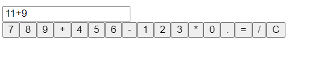

# Ex-06-Create-a-simple-calculator-built-with-React
## Aim:-
To Create a simple calculator built with React
## Algorithm:-
### Step 1: 
Set up a React project
### Step 2: 
Create the Calculator component
### Step 3: 
Set up the initial state
### Step 4: 
Create the button click handler
### Step 5:
Create the calculate and clear function
## Program:-
```js
import React, { useState } from 'react';

const Calculator = () => {
  const [result, setResult] = useState('');

  const handleButtonClick = (value) => {
    setResult((prevResult) => prevResult + value);
  };

  const calculateResult = () => {
    try {
      const evaluatedResult = eval(result);
      setResult(evaluatedResult.toString());
    } catch (error) {
      setResult('Error');
    }
  };

  const clearResult = () => {
    setResult('');
  };

  return (
    <div className="calculator">
      <input type="text" value={result} readOnly />
      <div className="buttons">
        <button onClick={() => handleButtonClick('7')}>7</button>
        <button onClick={() => handleButtonClick('8')}>8</button>
        <button onClick={() => handleButtonClick('9')}>9</button>
        <button onClick={() => handleButtonClick('+')}>+</button>
        <button onClick={() => handleButtonClick('4')}>4</button>
        <button onClick={() => handleButtonClick('5')}>5</button>
        <button onClick={() => handleButtonClick('6')}>6</button>
        <button onClick={() => handleButtonClick('-')}>-</button>
        <button onClick={() => handleButtonClick('1')}>1</button>
        <button onClick={() => handleButtonClick('2')}>2</button>
        <button onClick={() => handleButtonClick('3')}>3</button>
        <button onClick={() => handleButtonClick('*')}>*</button>
        <button onClick={() => handleButtonClick('0')}>0</button>
        <button onClick={() => handleButtonClick('.')}>.</button>
        <button onClick={() => calculateResult()}>=</button>
        <button onClick={() => handleButtonClick('/')}>/</button>
        <button onClick={() => clearResult()}>C</button>
      </div>
    </div>
  );
};

export default Calculator;

```
## Output:-

## Result:-
Thus the program To Created a simple calculator built with React.
